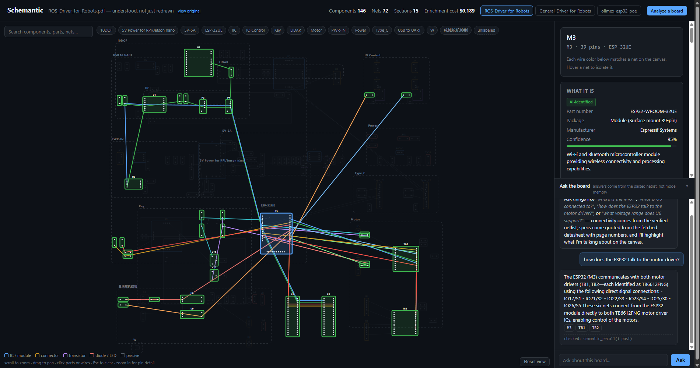
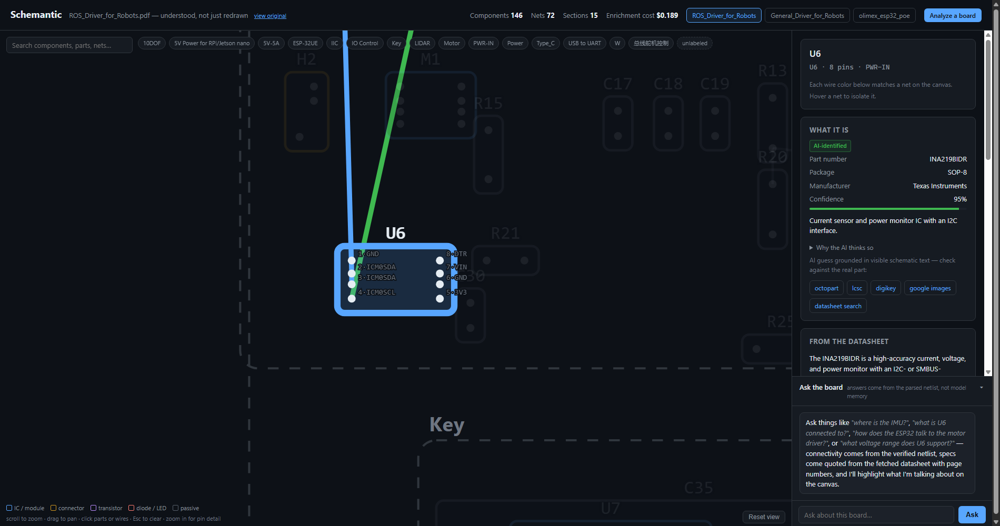

# Schemantic

[](https://github.com/ashutosh-rath02/schemantic/actions/workflows/tests.yml)
[](LICENSE)
[](pyproject.toml)

**A multi-agent system that turns a circuit board's schematic PDF into something actually
understood** -- a live connectivity graph, AI-identified parts with page-cited datasheet facts, a
grounded chat agent that reasons over the verified graph, and exports a coding agent can build
firmware from. Not a redraw: every wire you see is parsed fact, not a guess.

**Live demo:** http://3.220.187.89:8000/ (moving to `schemantic.ashutoshrath.me` shortly)



## Why this exists

A schematic PDF is a wall of reference designators and wires. Someone unfamiliar with a board --
a firmware engineer picking up a vendor reference design, an intern debugging someone else's
project -- can see that `U6` connects to something called `IIC_SDA`, but not *what U6 is*, *what
else is on that bus*, or *what this whole corner of the board does*. Getting those answers today
means hours of squinting at the PDF plus a dozen datasheet tabs.

Schemantic answers those questions directly: click any component to see what it actually is, ask
the board a question in plain English, or export everything as a hardware map a coding agent can
use to write real firmware against real, verified pins.

## What it does

- **Understands any Altium-exported schematic PDF or KiCad project** -- no CAD software, no
  original project file required for the PDF path. Verified on three independently-sourced boards
  from two different vendors and two different EDA tools.
- **Renders its own interactive canvas** -- pan/zoom, component bodies sized from real pin
  geometry, wires as real per-net connectivity. Click a component, everything it's wired to lights
  up with the path traced; click a wire, every component on that net highlights.
- **Identifies parts with evidence, not vibes** -- every AI guess ships with its reasoning, a
  confidence score, and one-click links to check it against the real part. Generic passives never
  touch the model at all -- there's nothing to identify.
- **Fetches and quotes real datasheets** -- facts are extracted with a verbatim quote and page
  number, then mechanically re-checked against the actual PDF page. A quote that doesn't match is
  dropped, never shown. Full-document search answers arbitrary spec questions beyond the initial
  digest.
- **Answers questions about the board in chat**, grounded entirely in tool calls over the verified
  graph -- never model recall -- with **persistent semantic memory** (SQLite + embeddings) so a
  reworded question weeks later still finds the original answer, across restarts.
- **Links multiple boards** -- an agent proposes which connectors on a master/slave pair likely
  mate, with pin-level evidence; a human confirms or rejects each one; only confirmed links become
  traversable in cross-board questions.
- **Exports a Hardware Map** (`.md`/`.json`) -- pin tables, bus inventories, power rails, datasheet
  links -- built for handing to a coding agent so it can write firmware against real, verified
  pins instead of guessing.
- **Generates starter firmware** -- a pin-definitions header and demo scaffold grounded in the
  hardware map, with `TODO` markers instead of invented values wherever the map genuinely doesn't
  know something.
- **Flags pre-fabrication issues** -- missing I2C pull-ups, floating enable pins, unidentified
  controllers, supply-rail mismatches -- split into mechanical (verified-connectivity-derived) and
  heuristic (AI-identity-derived) tiers, each labeled as such.

## See it work



## Architecture -- deterministic core, AI agents on top

The rule that shaped every decision in this codebase: **never let a model guess at something that
can be proven mechanically.**

```
Schematic PDF / KiCad project
        │
        ▼
┌───────────────────┐   deterministic -- no AI, hand-verified against real boards
│  Parser            │   Altium's embedded netlist tokens, or KiCad .net/.kicad_pcb
│  Graph + geometry   │   MST wire routing, power-rail classification, pin bounding boxes
└─────────┬──────────┘
          ▼
┌───────────────────────────────────────────────────────────┐  AI agents, narrowly scoped,
│  Part Identity  │  Region Explainer  │  Datasheet Digest    │  every output verifiable
│  (skips passives) │ (per section)    │  (quote + page cite)  │  against a mechanical check
└─────────┬─────────────────┬──────────────────┬─────────────┘
          ▼                 ▼                  ▼
   ┌─────────────────────────────────────────────────┐
   │  Supervisor -- cost budgets, spend tracking,     │
   │  thread-safe, hard caps on every model call      │
   └─────────────────────────────────────────────────┘
          │
          ▼
┌────────────────────────────────────────────────────────────────────┐
│  Graph API (tool layer, zero AI)  →  Chat Agent (tool-calling, memory) │
│  Mate Proposer (human-gated)      →  Hardware Map / Firmware Starter   │
│  Design Checks (mechanical + heuristic, tier-labeled)                 │
└────────────────────────────────────────────────────────────────────┘
          │
          ▼
   Interactive canvas · grounded chat · exports for a coding agent
```

1. **Netlist extraction (deterministic).** Altium's PDF export embeds invisible text at every pin
   and component location -- `PI<refdes><pin>`, `CO<refdes>`, `NL<netname>` -- meant for interactive
   net-highlighting in a PDF viewer. `schemantic/parser/netlist.py` reads it directly. Every
   connection is parsed fact, verified by hand against real schematics (e.g., a sensor's SDA pin
   lands on the SDA bus exactly as drawn; an IMU has exactly the pin count its real package has).
2. **Part identification (AI, narrow scope).** Generic resistors/capacitors never reach the model
   -- nothing to identify. Only ICs, connectors, and named transistors go through
   `schemantic/agents/part_identity.py`, each result carrying reasoning, confidence, and
   deterministic search links.
3. **Region explanation (AI).** Plain-English summaries of what each labeled subcircuit does,
   grounded only in the parts identified within it.
4. **Graph + geometry (deterministic).** The parse becomes a drawable connectivity graph: real pin
   bounding boxes, and per-net wires as a minimum spanning tree over real pin coordinates. Topology
   is exact and test-enforced; the specific wire *paths* are synthetic, not the original routes --
   stated plainly, not glossed over.
5. **Datasheet grounding (AI extracts, mechanics verify).** Every fact ships with a verbatim quote
   and page number; the quote is re-checked against the actual fetched PDF page, and anything that
   fails is dropped and counted, never shown.
6. **Multi-board workspaces (AI proposes, human confirms).** Connector matings can't be parsed --
   they're physical harness decisions in neither schematic -- so an agent proposes candidates with
   pin-level evidence, every proposal is mechanically validated against the real connectors before
   storage, and only human-confirmed links become traversable.
7. **Chat agent (tool-calling, grounded, with memory).** Can only answer through deterministic
   tool calls over the parsed graph -- every claim traces to a query, shown in the UI as
   provenance. Persistent semantic memory means conversations survive restarts and reworded
   questions still find prior answers.
8. **Supervisor.** Every model call anywhere in the system runs through a thread-safe cost-budget
   layer with hard spend caps -- no agent, however deep in a tool loop, can run unmetered.

## Built and verified across three real, independently-sourced boards

| | Board 1 (Altium PDF) | Board 2 (Altium PDF) | Board 3 (KiCad project) |
|---|---|---|---|
| Source | Waveshare ROS Driver | Waveshare General Driver | Olimex ESP32-PoE |
| Components | 146 | 149 | 135 |
| Nets | 72 | 74 | 125 |
| Parts identified | INA219, ICM-20948, TB6612FNG, ESP32... | QMI8658C, CP2102N... (different parts, same pipeline) | TPS2375 PoE controller, LAN8710A PHY, CH340T |

The second and third boards needed **zero parser code changes** -- the whole point of building on a
deterministic core.

## Honesty log -- real bugs found by reading actual output, not assumed away

This is the part of the codebase I'm most willing to defend under questioning. A running list of
mistakes caught by actually inspecting live output against ground truth, and exactly how each was
fixed:

- **A schema-ordering bug that let a model contradict itself.** Early on, a verdict field was
  requested before the reasoning meant to justify it -- structured-output APIs fill fields in
  declaration order, so the model was committing to an answer before thinking it through. Fixed by
  putting reasoning first everywhere in the schema.
- **A substring-matching bug mistook a section title for a component value** (`10-DOF-IMU-Sensor-D`
  matched as a capacitor value because `M` is a substring of `IMU`). Fixed with a proper anchored
  pattern; regression-tested.
- **A naive "any power rail counts as a pull-up" check would have missed I2C buses with only a
  pull-*down* to GND** -- caught by reading the actual resistor-to-net mapping on a real board (one
  resistor really was GND-tied, for an unrelated reason) before trusting the check's silence.
- **A voltage-range check false-flagged the board's own microcontroller** -- its datasheet says
  "3.0 to 3.6 V," but substring-matching only caught the upper bound "3.6," which doesn't textually
  appear in a "3V3" rail name even though 3.3V is well inside the real range. Fixed with actual
  numeric range containment.
- **The netlist format was misattributed to EasyEDA by assumption.** Checking PDF creator metadata
  across every sample settled it: every token-carrying PDF says `creator='Altium Designer'`.
  Corrected everywhere, including error messages users see.
- **A stricter token filter (fixing a KiCad false-positive) silently exposed a day-one bug**: an
  active-low enable net's token had been rejected by an overly loose check since the very first
  version, silently merging its pins into an unrelated net. Both reference boards were
  re-verified and locked in with regression tests after the fix.

Every one of these was found by generating real output and reading it critically, not by
assuming the pipeline was correct -- and each fix is now guarded by a test that reproduces the
original failure.

## Tech stack

Python · FastAPI · OpenAI (structured outputs, tool-calling, embeddings) · SQLite (semantic vector
memory) · PyMuPDF · vanilla JS + SVG (the canvas -- no framework, no build step) · pytest (81 tests,
almost all running against real enriched board data, not mocks)

## Run it

```bash
# .env with OPENAI_API_KEY must exist in the project root (see .env.example)
python -m venv .venv
./.venv/Scripts/pip install -e ".[dev]"
./.venv/Scripts/pytest -q
./.venv/Scripts/python -m uvicorn schemantic.web.app:app --reload
```

Open http://127.0.0.1:8000/. First load runs the full pipeline (~1 min, a few cents against a new
board) and caches by content hash; every later load is instant. Upload any Altium PDF or KiCad
`.net`/`.zip` via "Analyze a board."

## Not yet built

- Eagle/OrCAD support, and KiCad *PDF* exports specifically (no embedded netlist in KiCad's PDF --
  the source-file route is what's supported).
- Scanned/rasterized schematics with no embedded text layer -- needs real computer-vision symbol
  recognition, a fundamentally different problem, out of scope for now.
- Multi-page schematics -- the parser currently expects a single-page export.

## Repo layout

```
schemantic/
  parser/           deterministic PDF/KiCad → components, pins, nets
  graph.py          connectivity graph + wire geometry (MST)
  graph_api.py       tool layer the chat agent queries (zero AI)
  agents/           part identity, region explainer, datasheet digest,
                    chat, mate proposer, firmware starter
  datasheets.py     fetch + mechanical quote verification
  chat_memory.py    persistent semantic memory (SQLite + embeddings)
  workspace.py      multi-board store, mechanical mate validation
  design_checks.py  pre-fab checks, mechanical + heuristic tiers
  hardwaremap.py    coding-agent export
  supervisor/       cost budgets, thread-safe, hard caps
  web/              FastAPI app + canvas UI (vanilla JS/SVG)
tests/              81 tests, mostly against real enriched board payloads
```
